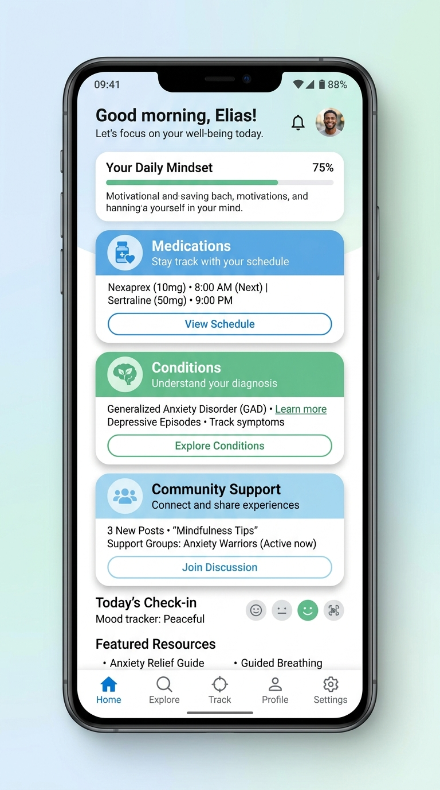
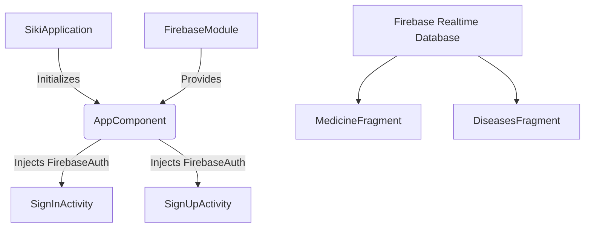

# Siki (سايكي) - Mental Health Support Application 🧠

<div align="center">
  
  <p>A comprehensive Android application designed to provide mental health resources, medication information, and community support for users in Libya.</p>
</div>

## 📖 Overview
**Siki** is a mobile platform built to bridge the gap in mental health awareness and support. The application offers a safe space for users to explore diseases, understand medications, and read supportive posts, adhering to the core principle: *"You are not alone."*

## 🏗️ Architecture & Tech Stack
This project is built with a focus on clean architecture, dependency injection, and modern Android development practices.

- **Language:** Java
- **Dependency Injection:** [Dagger 2](https://dagger.dev/) (Used for robust and scalable dependency management across the app lifecycle).
- **UI Architecture:** 
  - **View Binding:** Replaced legacy `findViewById` to guarantee null-safety and type-safety across UI components.
  - **Material Design:** Leveraging `com.google.android.material` for a modern, responsive user experience.
- **Backend & Cloud:**
  - **Firebase Authentication:** Secure email/password authentication system.
  - **Firebase Realtime Database:** NoSQL cloud database for fetching posts, diseases, and medication lists in real-time.
  - **Firebase Analytics:** For tracking user engagement and app performance.
- **Image Loading:** [Picasso](https://square.github.io/picasso/) for efficient remote image fetching and caching.

## ✨ Key Features
- 🔐 **Secure Authentication:** Robust user registration and login flow powered by Firebase Auth.
- 💊 **Medication Directory:** Browse a comprehensive list of mental health medications and their detailed information.
- 🩺 **Disease Information:** Educational resources on various mental health conditions.
- 📰 **Community Posts:** Real-time updates and articles fetched dynamically from Firebase.
- 📱 **Interactive UI:** Smooth navigation utilizing `BottomNavigationView` and `DrawerLayout`.

## ⚙️ System Architecture (Dependency Graph)



## 🚀 Getting Started

### Prerequisites
- Android Studio (Latest version recommended)
- Minimum SDK: API 16 (Jelly Bean)
- Target SDK: API 28 (Pie)

### Installation
1. Clone the repository:
   ```bash
   git clone https://github.com/yourusername/siki-app.git
   ```
2. Open the project in **Android Studio**.
3. Connect your project to Firebase:
   - Add your `google-services.json` file to the `app/` directory.
   - Ensure **Authentication (Email/Password)** and **Realtime Database** are enabled in your Firebase Console.
4. Clean and Rebuild the project so **Dagger 2** can generate the necessary dependency graphs (`DaggerAppComponent`).
5. Run the application on an emulator or physical device.

## 🛡️ Security
- Passwords are **not** stored in the database. The app relies entirely on Firebase Authentication's secure infrastructure.
- Data validation is implemented on the client side before interacting with Firebase services.
